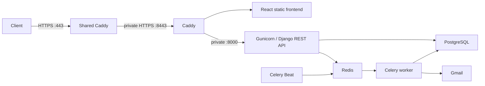
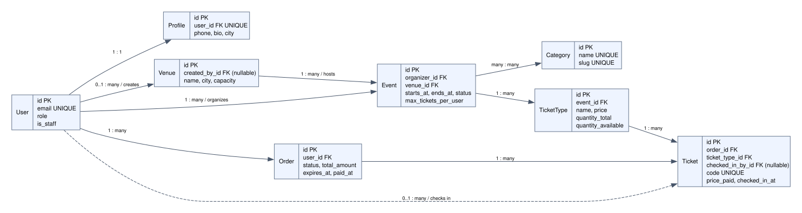

# Event Ticketing & Booking

[](https://github.com/Tapan48/event_ticket_booking_api/actions/workflows/ci.yml)
[](docs/deployment.md#frontend-release--2026-10-01)

A React marketplace backed by a Django REST API where organizers create events and sell tickets, and attendees browse, book, pay, and check in — built so that **two people can never buy the last ticket** (row locking with `select_for_update()`, atomic transactions, `F()` expressions, and database constraints).

> **Status:** Phases 0–7 are complete. The attendee/organizer frontend is live on Oracle with trusted HTTPS, Gmail ticket delivery, automated expiry and daily backups. CI passes: 247 backend tests (100% measured coverage), 10 frontend unit tests and four browser workflows. See the [roadmap](plan/plan_main.md) and [verified release](docs/deployment.md#frontend-release--2026-10-01).

## Oracle demo

Frontend: **https://event-ticket-booking.duckdns.org/**.
Developer Swagger: **https://event-ticket-booking.duckdns.org/api/docs/**.
The demo uses mock payments; no money is charged. Log in as
`organizer@demo.dev` or `attendee@demo.dev` with password `demo-pass-123`.
Public demo users have no staff/admin privileges. Use sample data only.



The shared Caddy entry point routes both domains on host ports 80/443. Ticket booking has separate containers,
credentials, networks, and data volumes. See [production setup, backups, and rollback](docs/deployment.md).

## Stack
React · TypeScript · Vite · Tailwind CSS · shadcn/ui · TanStack Query · Django 5.2 · Django REST Framework · SimpleJWT · drf-spectacular · PostgreSQL 16 · Celery + Redis 7 · Docker Compose · pytest · ruff

## API

Interactive docs: **http://localhost:8000/api/docs/** (Swagger UI). Log in there, then click *Authorize* and paste the access token.

| Endpoint | Access |
|---|---|
| `POST /api/auth/register/` | Public. Register as `attendee` (default) or `organizer`. |
| `POST /api/auth/login/`, `/refresh/`, `/logout/` | JWT pair; refresh tokens rotate and are blacklisted on logout. |
| `GET/POST/DELETE /api/auth/session/` | Browser session bootstrap/login/logout with CSRF protection. JWT clients are unchanged. |
| `GET/PATCH /api/auth/me/` | Your account and profile. |
| `/api/venues/` | Anyone reads; organizers create; the creator or staff edit. |
| `/api/categories/` (by slug) | Anyone reads; staff write. |
| `/api/events/` | Anyone reads published events; organizers also see their own drafts. The owner or staff edit. |
| `/api/ticket-types/` | Only the event's organizer adds or edits them. Stock (`quantity_available`) is read-only. |
| `POST /api/orders/` | Reserve tickets: `{"event": 1, "items": [{"ticket_type": 2, "quantity": 2}]}`. They're held for 15 minutes. |
| `GET /api/orders/`, `/api/orders/{id}/` | Your orders; anyone else's order returns 404. Ticket codes appear once the order is paid. |
| `POST /api/orders/{id}/pay/`, `/cancel/` | Mock payment, or cancel a pending order to release its tickets. |
| `GET /api/tickets/` | Your valid tickets (from paid orders). |
| `POST /api/checkin/` | `{"code": "…"}`. Staff or the event's organizer only. A second scan returns **409** with the first scan's time. |

Deleting something that is still referenced, such as a venue with events or an event with sold tickets, returns **409 Conflict**.

### Browsing events

Lists are paginated (`?page=`, `?page_size=` up to 100; default 20) and return `count`, `next`, `previous` and `results`.

```
GET /api/events/?city=pune&category=music&upcoming=true
GET /api/events/?starts_after=2026-10-01&starts_before=2026-11-01
GET /api/events/?min_price=500&max_price=1000&ordering=min_price
GET /api/events/?search=rock
```

| Parameter | Meaning |
|---|---|
| `city` | Venue city, case-insensitive. |
| `category` | Category slug. |
| `starts_after` / `starts_before` | ISO date or datetime; after is inclusive, before is exclusive. |
| `upcoming` | `true` for events that haven't started, `false` for events that have. |
| `min_price` / `max_price` | The event has **a single ticket type** in this range. |
| `status` | For organizers, e.g. `?status=draft` for their own drafts. |
| `search` | Title, description and venue name. |
| `ordering` | `starts_at` (the default), `created_at` or `min_price`. Prefix with `-` for descending. |

`mine=true` on events/venues returns only the authenticated organizer’s own records.

Venues filter by `?city=` and support `?search=`. Categories support `?search=`. Ticket types filter by `?event=<id>`.

## How overselling is prevented

When 20 people try to buy the last ticket at the same moment, exactly one succeeds. [`apps/orders/services.py`](apps/orders/services.py) does it in four layers:

```python
with transaction.atomic():
    # 1. One booking at a time per user.
    User.objects.select_for_update().get(pk=user.pk)
    # 2. Row locks on the ticket tiers, always taken in pk order.
    tiers = (
        TicketType.objects.select_for_update(of=("self",))
        .filter(pk__in=ids, event_id=event_id)
        .order_by("pk")
    )
    ...  # validate stock and the per-user limit
    # 3. Atomic decrement, done in SQL.
    TicketType.objects.filter(pk=tier.pk).update(quantity_available=F("quantity_available") - qty)
# 4. CHECK (quantity_available >= 0) in Postgres is the backstop -> 409 "Sold out".
```

1. **Per-user lock.** Locking the buyer's row makes one person's parallel requests queue up, so `max_tickets_per_user` can't be beaten by double-clicking.
2. **`select_for_update()` on the ticket tiers.** The second buyer waits until the first commits, then sees the real stock. Locks are always taken in primary-key order, so two orders for the same tiers can't deadlock.
3. **`F()` expressions.** The decrement runs as `SET quantity_available = quantity_available - n` in the database, never as a Python read-modify-write.
4. **A database constraint.** Even if application code were wrong, Postgres refuses to let stock go negative.

**Proof:** [`apps/orders/tests/test_concurrency.py`](apps/orders/tests/test_concurrency.py) runs real threads against Postgres, released together by a barrier:
- 20 buyers for 1 ticket → exactly 1 sale;
- 30 buyers for 10 → exactly 10;
- a user racing themselves can't exceed their limit;
- 10 simultaneous scans of one ticket admit it once.

A **negative control** runs a naive, unlocked read-check-write booking in the same harness and shows it *does* oversell. That proves the test really creates races. Every test passes 20 out of 20 repeated runs (`pytest apps/orders/tests/test_concurrency.py --count=20`).

Check-in uses the same idea: a single `UPDATE … WHERE code = … AND checked_in_at IS NULL`. Postgres re-checks the condition after a concurrent scan commits, so a ticket can never be admitted twice.

## Background jobs (Celery + Redis)

| Job | Trigger | What it does |
|---|---|---|
| `send_ticket_email` | Queued by payment through `transaction.on_commit` | Emails the buyer an HTML + text message with their ticket codes. It retries SMTP or connection errors with exponential backoff, up to 5 times. A rolled-back payment never sends. |
| `expire_stale_orders` | Celery beat, every 60 s | Expires `pending` orders past their 15-minute hold and puts the tickets back on sale. It uses `select_for_update(skip_locked=True)`, so an order being paid at that moment is skipped rather than blocking, and it releases through the same idempotent path as cancel. A pay-vs-expire race test proves stock is restored exactly once. |

In development, every email lands in **Mailpit** at http://localhost:8025.

## Data model

Users (attendees and organizers) · Venues · Events (with categories) · Ticket types · Orders · Tickets.


See the **[ER diagram and constraint list](docs/erd.md)**.

The overselling backstop is a PostgreSQL `CHECK (quantity_available >= 0)` on ticket types. Even a decrement that slips past every application check is rejected by the database. This is proven in `apps/events/tests/test_models.py::TestTicketType::test_database_blocks_overselling`.

## Quickstart

```bash
cp .env.example .env
docker compose up --build                                   # web on :8000, Postgres on host port 5434, Redis
docker compose run --rm web python manage.py migrate
docker compose run --rm web python manage.py seed_demo      # demo users, venues, events, ticket types
docker compose run --rm web python manage.py createsuperuser
curl localhost:8000/health/                                 # {"status": "ok", "database": "ok"}
open http://localhost:8025                                  # Mailpit: emails sent by the worker
```

Admin is at http://localhost:8000/admin/; log in with the superuser you created. The demo users (`organizer@demo.dev`, `organizer2@demo.dev`, `attendee@demo.dev`, `staff@demo.dev`) share the password `demo-pass-123`; use them to log in to the API.

## Frontend development

With the API running on port 8000, use Node 24 in a second terminal:

```bash
cd frontend
npm ci
npm run dev
```

Open the printed Vite URL (normally http://localhost:5173). Vite proxies API requests
to Django, so no frontend credentials or environment file are needed. See the
[frontend guide](frontend/README.md) for tests and the available screens.

## Development

```bash
docker compose run --rm web pytest --cov                # tests (always against Postgres)
docker compose run --rm web ruff check .                # lint
docker compose run --rm web ruff format .               # format
```

Git hooks (ruff + basic checks) run via [pre-commit](https://pre-commit.com):

```bash
python3 -m venv .venv && .venv/bin/pip install pre-commit && .venv/bin/pre-commit install
```

`docker compose up` also starts the Celery `worker` and `beat` and Mailpit. The worker doesn't auto-reload, so run `docker compose restart worker beat` after changing task code.
