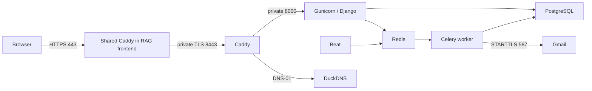

# Oracle deployment and operations

Public frontend: **https://event-ticket-booking.duckdns.org/**.
Swagger for development/testing: **https://event-ticket-booking.duckdns.org/api/docs/**.
Health endpoint: `/health/`. This is a portfolio demo using mock payments.

## Isolation and ports

The Compose project is `ticket-booking`, located at `/home/ubuntu/ticket-booking-api`.
The ARM64 VM is shared with the RAG project. Its Caddy frontend owns host 80/443
and routes each domain separately. The ticket proxy remains reachable on 8443 for
compatibility and rollback; the canonical ticket URL uses 443 with no port suffix.
Only the two proxies join the external Docker network `ticket-edge`; DB, Redis,
and backend services stay on their own project networks. Never run global Docker
prune, restart Docker, or reboot the host for a ticket release. Normal ticket releases
do not operate on the RAG Compose project.



Caddy serves the bundled React frontend, including SPA deep links. `/api/`, `/admin/`,
`/static/` and `/health/` still route to Django. Browser login uses secure HttpOnly
session cookies with CSRF protection; JWT endpoints remain available for API clients.
The frontend needs no runtime secrets or additional public ports.

Caddy uses the DuckDNS plugin for certificate issuance and automatic renewal.
DNS-01 needs no incoming connection on 80/443. Certificate state persists in the
ticket project's `caddy_data` volume. DuckDNS must point to the instance's public IP.
OCI ingress must allow TCP 8443 from `0.0.0.0/0`; this rule has been added. Docker
publishes 8443 through its forwarding rules. Verify host forwarding and external
reachability; do not replace the existing firewall or flush rules.

## Private configuration

Local `.env` holds `GMAIL_ADDRESS`, `GMAIL_APP_PASSWORD`, and `DUCKDNS_API_TOKEN`.
Generate production credentials **once**, on your trusted machine:

```bash
python3 deploy/make_env.py
```

This writes `.env.prod` with mode 0600, fresh database/signing secrets, and a
percent-encoded Gmail SMTP URL; whitespace in the App Password is removed. Existing
output is never overwritten. Copy it privately via SCP/SSH into the server's ticket
directory and keep mode 0600. Never paste its contents into logs or use a full
`docker compose config` dump; use `config --quiet`. The proxy receives only DNS/TLS
settings, and application services receive only their own settings. Examples contain
placeholders. Secrets, keys, backups, and `.deploy/` are excluded from Git and builds.

Only `.env.prod` on the server is needed at runtime; the Gmail variables in local
`.env` are provisioning inputs, not Django's runtime email settings. Gmail App Passwords
require 2-Step Verification. Actual sending remains subject to Google's account limits.

## Build and release

Build on an ARM64 machine (the developer's Docker environment is ARM64), tag with
the tested Git commit SHA, and transfer images using `docker save` over SSH into
`sudo docker load`. This avoids consuming the shared server's CPU on image builds.

```bash
git rev-parse HEAD
# Use the resulting full SHA in place of COMMIT_SHA below.
docker build --target production -t ticket-booking-app:COMMIT_SHA .
docker build -f deploy/caddy/Dockerfile -t ticket-booking-proxy:COMMIT_SHA .
```

Upload the tracked source with `git archive COMMIT_SHA` over SSH, excluding all
untracked configuration. Keep the deployment in the separate ticket directory.
From that directory on the server:

```bash
sudo sh deploy/release.sh COMMIT_SHA
sudo sh deploy/compose.sh run --rm --no-deps web python manage.py seed_demo --public
sudo sh deploy/compose.sh ps
```

The release script checks images/configuration, backs up an existing deployment,
starts DB/Redis, runs migrations and Django deployment checks, then starts all ticket
services. It persists the release tag after container health checks. Verify the public
HTTPS endpoint separately: a running proxy alone does not prove certificate issuance.
No schema changes are introduced by Phase 6 itself.

Use the documented organizer/attendee demo credentials only. Production seeding
refuses to create the public staff account. Create administrative accounts separately
with `createsuperuser` if needed; never publish their passwords.

## Health, logs, and recovery

```bash
curl --fail https://event-ticket-booking.duckdns.org/health/
sudo sh deploy/compose.sh ps
sudo sh deploy/compose.sh logs --tail 100 web worker beat
sudo sh deploy/compose.sh restart web worker beat
```

All services restart unless explicitly stopped. PostgreSQL, the Redis queue, Beat
schedule, and certificates have dedicated persistent volumes. Logs rotate at 10 MB
with three files per container. Web health checks exercise database connectivity;
worker health checks use a targeted Celery ping. Verify Beat by observing an overdue
pending order expire and stock return within the next sweep (normally 60 seconds).

## Backups and restore

```bash
sudo sh deploy/backup.sh
sudo sh deploy/verify-restore.sh /home/ubuntu/ticket-booking-api/backups/BACKUP.dump
```

Backups use PostgreSQL's custom format, mode 0600, atomic file replacement, and a
seven-day local retention window. The minimal VM has no active cron service; install
the dedicated systemd timer instead:

```bash
sudo install -m 644 deploy/systemd/ticket-booking-backup.service deploy/systemd/ticket-booking-backup.timer /etc/systemd/system/
sudo systemctl daemon-reload
sudo systemctl enable --now ticket-booking-backup.timer
sudo systemctl start ticket-booking-backup.service
sudo systemctl list-timers ticket-booking-backup.timer
sudo journalctl -u ticket-booking-backup.service --no-pager -n 20
```

The timer runs daily at 02:17 UTC, with up to five minutes of jitter, and catches up
after downtime. It operates only on the ticket-booking Compose project.

Verify restoration into the helper's disposable database, which is dropped afterward.
Copy backups off the VM after releases and regularly afterward. A local copy is not
protection against loss of the entire instance. On the trusted developer machine,
stream the selected dump through SSH into a mode-0600 file under ignored `.deploy/backups/`.
Do not copy production backups into CI or commit them. Keep at least the latest verified
offsite copy; automate recurring offsite retrieval from a machine that stays online.

For a deliberate live restore, stop **ticket web/worker/Beat only**, create an emergency
dump, restore the selected backup into the ticket database with PostgreSQL tools, and
restart the same ticket services. Do not restore over a running app or the RAG database.

## Rollback

Keep the previous tagged images and matching source archive. Re-run `release.sh`
with the prior tag and compatible source. If a new migration is incompatible with the
old application, stop ticket web/worker/Beat and restore the pre-release database backup
before bringing the prior version up. Never delete volumes to roll back. If a release
fails before persisting its tag, inspect running images: some services may already use
the attempted version. Restore the previous source and explicitly start the prior images.

## Release acceptance

- CI lint, format, migration drift, PostgreSQL tests, and ≥90% coverage pass.
- Secret scans pass for full Git history and the outgoing changes.
- HTTPS is trusted; Swagger, schema, static assets, and health respond successfully.
- Registration/login → booking → mock payment → ticket email → organizer check-in
  works; double check-in returns 409. An unpaid order expires and restores inventory.
- Ticket-container restart preserves data and resumes processing; a backup restores.
- RAG container IDs/start times, health, configuration, and host 80/443 bindings are unchanged.

## Verified release — 2026-09-30

Application and proxy image tag: `022007ba01955a8c83c1307eea05853e090ca04e`.
Later commits install the dedicated backup timer and record acceptance; they do not
change application/proxy code. [Release CI](https://github.com/Tapan48/event_ticket_booking_api/actions/runs/36732933769)
passed all jobs: **237 tests, 100% measured coverage**, lint/format, migration drift,
production image/proxy checks, and full-history Gitleaks scanning.

| Check | Observed result |
|---|---|
| HTTPS and docs | Trusted Let's Encrypt certificate via DNS-01; health/database OK; Swagger rendered 38 operations and schema returned 200; static CSS returned 200. |
| Booking lifecycle | Registration/login, reserve/pay, ticket listing, check-in, duplicate 409, cancellation and stock restoration passed over public HTTPS. |
| Email | Matching verification ticket delivered to the owner's Gmail inbox in HTML and text; owner confirmed receipt. |
| Restart and expiry | All six ticket containers restarted successfully. Beat expired the test order on its next sweep and restored stock; paid ticket/check-in state persisted. Only the test order deadline was advanced; the runtime hold remains 15 minutes. |
| Restore | `ticketing-20260930T150938Z.dump` restored into a disposable database: 33 migrations and 9 events. Verification database removed afterward. |
| Offsite copy | Same dump copied privately to the developer's Mac under ignored `.deploy/backups/`, mode 0600; SHA-256 matched. |
| Daily scheduling | systemd timer enabled; manual execution of its service produced `ticketing-20260930T151410Z.dump` successfully. |
| Existing RAG | Five original container IDs/start times and 80/443 bindings preserved; all healthy; public HTTPS frontend returned 200. |

The coverage badge records this measured release result; CI enforces a 90% minimum.
Backups on the VM run automatically. Continue copying them offsite regularly as
described above; the deployment created one verified offsite copy.

## Frontend release — 2026-10-01

Application/proxy image tag: `5db208f137c86265b51440473c4a01cda83ac6f1`.
[Release CI](https://github.com/Tapan48/event_ticket_booking_api/actions/runs/36786715059)
passed all four jobs: 247 backend tests with 100% measured coverage, 10 frontend
unit tests, four real-API browser workflows, production images and secret scanning.
The release date is Asia/Kolkata; server/CI timestamps are UTC on September 30.

The public root now serves the responsive marketplace. Deep links and cached assets
work; Swagger/JWT remain available. Live browser verification covered organizer
creation/publication, secure login, reserve/pay/tickets, cancellation and stock return,
check-in and duplicate rejection, mobile layout and Swagger, with no page errors.
The matching ticket email arrived in the owner's Gmail and was confirmed by the owner.
A controlled hold expired through Beat and restored stock; its UI disabled payment.
Browser CSRF rejection, frontend CSP and cookie security flags were verified.

The upgrade created `ticketing-20260930T224215Z.dump` before changing containers.
It restored successfully into a disposable DB (33 migrations, nine events), and its
private offsite copy matched SHA-256. The daily timer remains active. No migrations
were needed. All five original RAG containers retained IDs, start times, health and
80/443 bindings; the RAG public HTTPS endpoint remained 200.

Full acceptance details: [Phase 7](../plan/plan_7_frontend.md). Documentation-only
commits after this release do not require rebuilding the application images.

## Shared HTTPS entry point — 2026-10-08

The existing RAG Caddy now has a ticket-domain site block. It obtains and renews
its own public certificate through the existing 80/443 entry point, then proxies to
`https://ticket-origin:8443` over the private `ticket-edge` network. Upstream TLS is
verified against `event-ticket-booking.duckdns.org`; verification is never disabled.
The original Host is preserved so Django sees the public origin. Both clean and
legacy `:8443` origins are allowed for CSRF during the compatibility period.

Provision the network once before either production stack uses it:

```sh
docker network create --driver bridge --internal ticket-edge
docker network inspect ticket-edge --format '{{.Driver}} {{.Internal}}'
```

Expected network properties: `bridge true`; only the RAG frontend and ticket proxy
should be members. `deploy/release.sh` calls `deploy/ensure-edge-network.sh` to
create/validate this network on subsequent releases.

The RAG repository's `compose.public.yml` joins only its frontend to that network
and bind-mounts `frontend/Caddyfile.public` read-only. Its original API/static/SSE
routes and certificate volumes are preserved. Changes to that configuration need
validation and a frontend-only recreation because the existing Caddy admin API is
disabled. Do not recreate RAG API/worker/DB/Redis for this change.

Release order: back up both proxy configurations and the ticket Compose file;
validate both Compose files and the new Caddyfile; create the network; recreate
only ticket web/worker/beat/proxy to apply the origin/network settings; then recreate
only the RAG frontend with `--no-deps --no-build`. Validate both public domains,
HTTP redirects, clean-origin login and a CSRF-protected write, Swagger, and the
legacy URL. Compare RAG backend container IDs/start times against the baseline.

Rollback: restore the saved RAG `compose.public.yml` and `frontend/Caddyfile.public`
and recreate only its frontend. The original RAG route and public 80/443 mappings
return; ticket booking remains available on 8443. Restore the previous ticket
Compose file and recreate its application/proxy services if its settings also need
reverting. Keep all database and certificate volumes. No schema change is involved.

Verified on 2026-10-08: both clean HTTPS domains and health routes returned 200;
both HTTP endpoints redirected to HTTPS without a port suffix. Clean-origin browser
login, secure cookies, private orders, a CSRF-protected save, reload/logout and
Swagger passed with no page errors. The upstream legacy endpoint remains healthy.
`ticket-edge` reports `bridge internal=true` with exactly the two proxy members.
RAG API/worker/DB/Redis retained their pre-change IDs/start times and health.
Configuration backups are under the private server directory
`.shared-https-backup-20261008`; ticket DB backup:
`ticketing-20261008T163557Z.dump`. No secrets or database migrations were changed.
