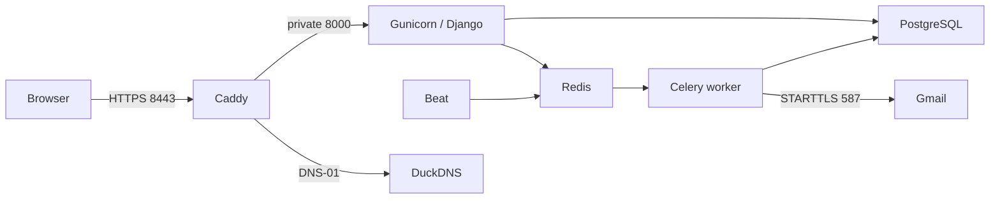

# Oracle deployment and operations

Public Swagger URL: **https://event-ticket-booking.duckdns.org:8443/api/docs/**.
Health endpoint: `/health/`. This is a portfolio demo using mock payments.

## Isolation and ports

The Compose project is `ticket-booking`, located at `/home/ubuntu/ticket-booking-api`.
The ARM64 VM is shared with the existing RAG project. Only the ticket proxy publishes
host **TCP 8443**. RAG retains host 80/443. Never run global Docker prune, restart Docker,
reboot the host, or operate on the RAG Compose project for a ticket-booking release.



Caddy uses the DuckDNS plugin for certificate issuance and automatic renewal.
DNS-01 needs no incoming connection on 80/443. Certificate state persists in the
ticket project's `caddy_data` volume. DuckDNS must point to the instance's public IP.
OCI ingress must allow TCP 8443 from `0.0.0.0/0`; this rule has been added. Docker
publishes 8443 through its forwarding rules. Verify host forwarding and external
reachability; do not replace the existing firewall or flush rules.

## Private configuration

Local `.env` holds `GMAIL_ADDRESS`, `GMAIL_APP_PASSWORD`, and `DUCKDNS_API_TOKEN`.
Generate production credentials **once**, on your trusted machine:

```bash
python3 deploy/make_env.py
```

This writes `.env.prod` with mode 0600, fresh database/signing secrets, and a
percent-encoded Gmail SMTP URL; whitespace in the App Password is removed. Existing
output is never overwritten. Copy it privately via SCP/SSH into the server's ticket
directory and keep mode 0600. Never paste its contents into logs or use a full
`docker compose config` dump; use `config --quiet`. The proxy receives only DNS/TLS
settings, and application services receive only their own settings. Examples contain
placeholders. Secrets, keys, backups, and `.deploy/` are excluded from Git and builds.

Only `.env.prod` on the server is needed at runtime; the Gmail variables in local
`.env` are provisioning inputs, not Django's runtime email settings. Gmail App Passwords
require 2-Step Verification. Actual sending remains subject to Google's account limits.

## Build and release

Build on an ARM64 machine (the developer's Docker environment is ARM64), tag with
the tested Git commit SHA, and transfer images using `docker save` over SSH into
`sudo docker load`. This avoids consuming the shared server's CPU on image builds.

```bash
git rev-parse HEAD
# Use the resulting full SHA in place of COMMIT_SHA below.
docker build --target production -t ticket-booking-app:COMMIT_SHA .
docker build -t ticket-booking-proxy:COMMIT_SHA deploy/caddy
```

Upload the tracked source with `git archive COMMIT_SHA` over SSH, excluding all
untracked configuration. Keep the deployment in the separate ticket directory.
From that directory on the server:

```bash
sudo sh deploy/release.sh COMMIT_SHA
sudo sh deploy/compose.sh run --rm --no-deps web python manage.py seed_demo --public
sudo sh deploy/compose.sh ps
```

The release script checks images/configuration, backs up an existing deployment,
starts DB/Redis, runs migrations and Django deployment checks, then starts all ticket
services. It persists the release tag after container health checks. Verify the public
HTTPS endpoint separately: a running proxy alone does not prove certificate issuance.
No schema changes are introduced by Phase 6 itself.

Use the documented organizer/attendee demo credentials only. Production seeding
refuses to create the public staff account. Create administrative accounts separately
with `createsuperuser` if needed; never publish their passwords.

## Health, logs, and recovery

```bash
curl --fail https://event-ticket-booking.duckdns.org:8443/health/
sudo sh deploy/compose.sh ps
sudo sh deploy/compose.sh logs --tail 100 web worker beat
sudo sh deploy/compose.sh restart web worker beat
```

All services restart unless explicitly stopped. PostgreSQL, the Redis queue, Beat
schedule, and certificates have dedicated persistent volumes. Logs rotate at 10 MB
with three files per container. Web health checks exercise database connectivity;
worker health checks use a targeted Celery ping. Verify Beat by observing an overdue
pending order expire and stock return within the next sweep (normally 60 seconds).

## Backups and restore

```bash
sudo sh deploy/backup.sh
sudo sh deploy/verify-restore.sh /home/ubuntu/ticket-booking-api/backups/BACKUP.dump
```

Backups use PostgreSQL's custom format, mode 0600, atomic file replacement, and a
seven-day local retention window. The minimal VM has no active cron service; install
the dedicated systemd timer instead:

```bash
sudo install -m 644 deploy/systemd/ticket-booking-backup.service deploy/systemd/ticket-booking-backup.timer /etc/systemd/system/
sudo systemctl daemon-reload
sudo systemctl enable --now ticket-booking-backup.timer
sudo systemctl start ticket-booking-backup.service
sudo systemctl list-timers ticket-booking-backup.timer
sudo journalctl -u ticket-booking-backup.service --no-pager -n 20
```

The timer runs daily at 02:17 UTC, with up to five minutes of jitter, and catches up
after downtime. It operates only on the ticket-booking Compose project.

Verify restoration into the helper's disposable database, which is dropped afterward.
Copy backups off the VM after releases and regularly afterward. A local copy is not
protection against loss of the entire instance. On the trusted developer machine,
stream the selected dump through SSH into a mode-0600 file under ignored `.deploy/backups/`.
Do not copy production backups into CI or commit them. Keep at least the latest verified
offsite copy; automate recurring offsite retrieval from a machine that stays online.

For a deliberate live restore, stop **ticket web/worker/Beat only**, create an emergency
dump, restore the selected backup into the ticket database with PostgreSQL tools, and
restart the same ticket services. Do not restore over a running app or the RAG database.

## Rollback

Keep the previous tagged images and matching source archive. Re-run `release.sh`
with the prior tag and compatible source. If a new migration is incompatible with the
old application, stop ticket web/worker/Beat and restore the pre-release database backup
before bringing the prior version up. Never delete volumes to roll back. If a release
fails before persisting its tag, inspect running images: some services may already use
the attempted version. Restore the previous source and explicitly start the prior images.

## Release acceptance

- CI lint, format, migration drift, PostgreSQL tests, and ≥90% coverage pass.
- Secret scans pass for full Git history and the outgoing changes.
- HTTPS is trusted; Swagger, schema, static assets, and health respond successfully.
- Registration/login → booking → mock payment → ticket email → organizer check-in
  works; double check-in returns 409. An unpaid order expires and restores inventory.
- Ticket-container restart preserves data and resumes processing; a backup restores.
- RAG container IDs/start times, health, configuration, and host 80/443 bindings are unchanged.
