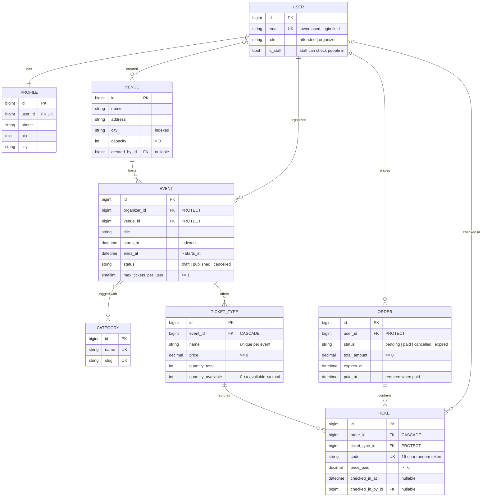

# Entity-Relationship Diagram

Every model except `Category` also has `created_at` / `updated_at` from `common.models.TimeStampedModel`. The event ↔ category link is a Django many-to-many join table (`events_event_categories`).

## Database constraints

These are enforced by PostgreSQL. They hold even if application code has a bug or two requests race each other.

| Constraint | Table | Guarantees |
|---|---|---|
| `ticket_type_quantity_available_non_negative` | ticket type | **Stock can never go below zero, so no overselling.** This is the backstop behind the Phase 4 row locking. |
| `ticket_type_available_lte_total` | ticket type | Stock never exceeds what was issued. Combined with the constraint above, the total is ≥ 0 too. |
| `unique_ticket_type_name_per_event` | ticket type | One "VIP" tier per event. |
| `ticket_type_price_non_negative` | ticket type | No negative prices. |
| `unique_ticket_code` | ticket | Every scannable ticket code is unique. |
| `ticket_price_paid_non_negative` | ticket | No negative ticket prices. |
| `ticket_checked_in_by_requires_time` | ticket | A check-in always records when it happened. |
| `order_paid_requires_paid_at` | order | A paid order always records when it was paid. |
| `order_total_non_negative`, `order_status_valid` | order | Valid totals and statuses. |
| `event_ends_after_starts` | event | Events end after they start. |
| `event_max_tickets_per_user_positive`, `event_status_valid` | event | Sane per-user limit and valid status. |
| `venue_capacity_positive` | venue | Venues hold at least one person. |
| `user_role_valid` | user | Role is attendee or organizer. |

## Indexes worth knowing

- `event_status_starts_idx (status, starts_at)` serves the public "published upcoming events" listing.
- `order_status_expires_idx (status, expires_at)` serves the Celery sweep that expires unpaid orders after 15 minutes.
